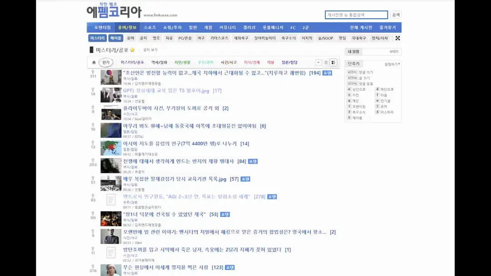
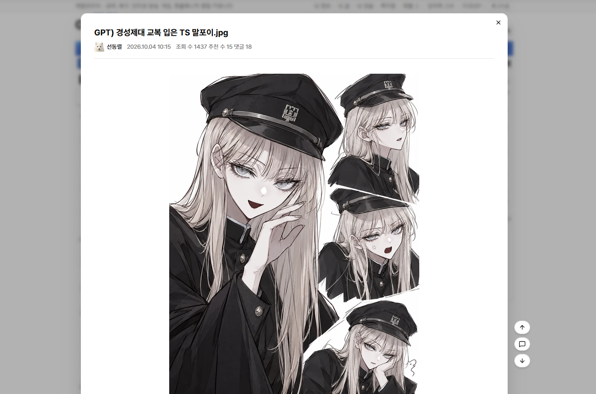
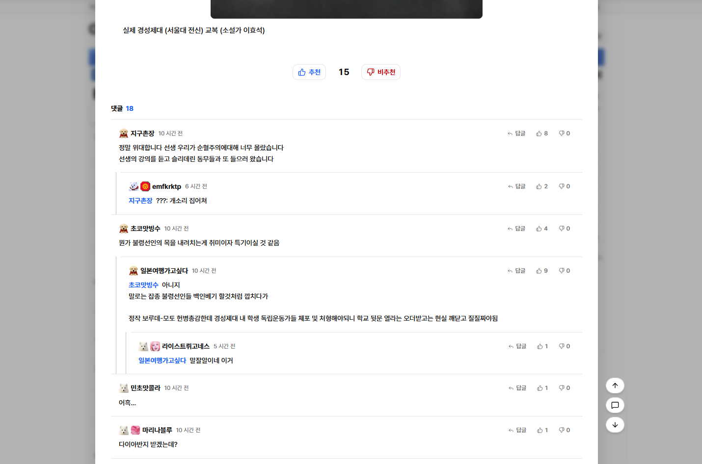

# Fmkorea Preview - 에펨코리아 게시글 미리보기

에펨코리아(fmkorea.com) 게시글을 페이지 이동 없이 **우클릭 한 번으로 미리볼 수 있는** 브라우저 확장 프로그램입니다.

Chrome과 Firefox를 지원합니다.

## 설치 링크

- [Chrome Web Store](https://chromewebstore.google.com/detail/fmkorea-preview-%EC%97%90%ED%8E%A8%EC%BD%94%EB%A6%AC%EC%95%84-%EA%B2%8C%EC%8B%9C%EA%B8%80/bboddojafohhhnbdifnlmmmbfngjldhf?authuser=0&hl=ko)

- [Firefox Add-ons](https://addons.mozilla.org/ko/firefox/addon/fmkorea-preview-%EC%97%90%ED%8E%A8%EC%BD%94%EB%A6%AC%EC%95%84-%EA%B2%8C%EC%8B%9C%EA%B8%80-%EB%AF%B8%EB%A6%AC%EB%B3%B4%EA%B8%B0/)

## 미리보기







## 사용법

| 동작                   | 결과                    |
| ---------------------- | ----------------------- |
| 게시글 제목 **우클릭** | 미리보기 열기           |
| **Shift** + 우클릭     | 브라우저 기본 메뉴 열기 |
| **Esc** / 바깥 클릭    | 미리보기 닫기           |
| 브라우저 **뒤로 가기** | 미리보기 닫기           |

## 기능

### 게시글

- 본문 보기 (이미지, 영상 포함)
- 추천 / 비추천
- 미리보기 오른쪽 이동 버튼 (맨 위로 · 댓글로 · 맨 아래로)
- 사이트 야간 모드를 그대로 따라감

### 댓글

- 댓글 목록 및 페이지 이동
- 베스트 댓글 강조 표시
- 답글 스레드를 세로 가이드 라인으로 표시
- 댓글 · 답글 작성 (`Ctrl + Enter`로 등록)
- 댓글 추천 / 비추천

### 작성자 메뉴

닉네임을 누르면 사이트와 같은 메뉴가 열립니다.

- 쪽지 보내기 · 회원 정보 · 작성 글 보기
- 블라인드 추가(메모 입력) / 해제

### 미디어 임베드

본문과 댓글의 링크를 자동으로 임베드합니다.

- **영상:** YouTube(쇼츠, 시작 시간 지원), 치지직 클립, SOOP VOD
  - 썸네일을 먼저 보여 주고, 누르면 재생합니다.
- **게시물:** X(Twitter), Instagram
- 링크가 걸리지 않은 URL은 자동으로 링크로 바꿉니다.

### 설정

확장 아이콘 → **설정**에서 바꿀 수 있습니다. 설정은 브라우저 동기화를 따라 다른 기기에도 적용됩니다.

- 미리보기 창 너비 (640 ~ 1600px)
- 영상 기본 볼륨
- 사이트 · 미리보기 글꼴 (PC에 설치된 글꼴)

## 기술 스택

- [WXT](https://wxt.dev/) (Manifest V3, Chrome · Firefox)
- React 19 · TypeScript
- Tailwind CSS v4 · [Base UI](https://base-ui.com/)
- TanStack Query
- DOMPurify (가져온 HTML 정화)
- [Bun](https://bun.sh/) (패키지 매니저)

## 개발

```bash
bun install

bun run dev          # Chrome 개발 모드
bun run dev:firefox  # Firefox 개발 모드
bun run compile      # 타입 검사
```

> `bun build`처럼 `run` 없이 실행하면 package.json 스크립트가 아니라 Bun 자체 명령어가 실행되니 꼭 `bun run`을 붙여 주세요.

개발 모드는 React 개발용 빌드를 써서 실제보다 느립니다. 성능은 빌드 결과물로 확인하세요.

## 빌드

```bash
bun run build          # .output/chrome-mv3
bun run build:firefox  # .output/firefox-mv3

bun run zip            # 스토어 업로드용 zip (Chrome)
bun run zip:firefox    # 스토어 업로드용 zip (Firefox)
```

## 폴더 구조

```text
entrypoints/
  preview.content/  미리보기 (Shadow DOM 안에 렌더링되는 content script)
  content.ts        사이트 글꼴 적용
  popup/            확장 아이콘 팝업
  options/          설정 페이지
components/
  preview/          미리보기 UI (본문, 댓글, 임베드, 작성자 메뉴 등)
  ui/               공통 UI (Button, Dialog, Toast)
hooks/              데이터 요청 · 저장소 훅
lib/
  api/              fmkorea 요청 함수, URL 유틸
  parser.ts         게시글 · 댓글 HTML 파싱
  embed.ts          미디어 임베드 판별
  settings.ts       설정 항목 정의
```
